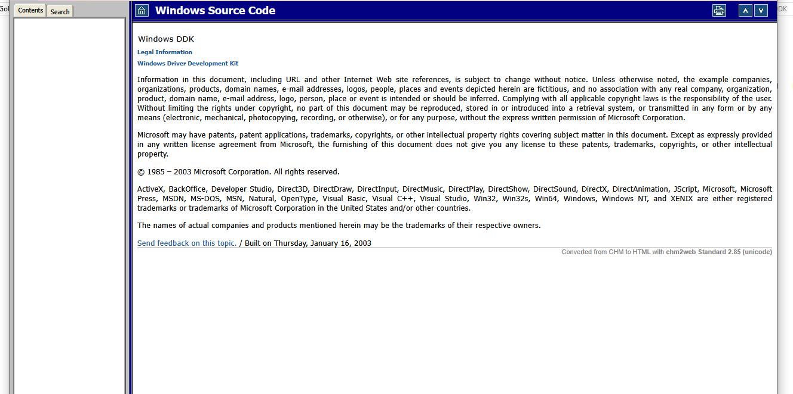
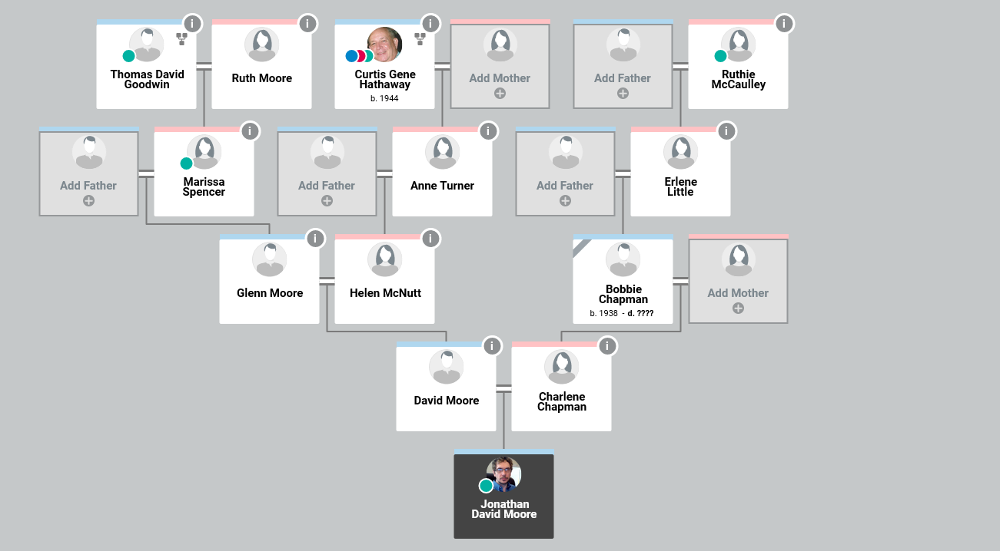

Microsoft Windows XP/2003 3790 DDK, SDK and 2005 MSDN Library has beed decompiled
from a 2003 Microsoft HXS Techical Incident in my name and will be up in this form 
above in 2027. Which is already done just needs to be pushed server side.

In 2013 I was taken off on respiridal and placed on invega whiched cuases a mental awakening 
according to my psycican.

I went to Hollins Communications with the Actress Emily Blunt. In 1999 my first investment 
was at Moors and Cabot when CNN anchor Aaron Brown said my name on national TV and called me famous on TV for Macromedia he died in 2024
and then the actress Anne Hathaway started calling we've been talking on the phone 
ever since. We have a NDA business partnership between us.

She gave me $99K in 2025 which I gave $21k back for her FBI Wedding Movie I bought 
a Mac Pro 2025 M3, and Digital Storm PC and <a href="https://developer.apple.com/programs/">Apple Developer Program </a>,<a href="https://www.microsoft.com/en-us/d/visual-studio-enterprise-subscription/dg7gmgf0dst4">Microsoft Visual Studio Subscription</a> my first 
since 2019.

I've been working on Bill Gates Hard Drive for 20 years which I put into a 100
terabyte Orico. I paid for Microsoft's Gold Partnership and awaiting a Premier
Support Email. I also bought and real life Terminator arm metal replica, LEGO Mindstorms, 
Steinberg Cubase, Cycling 74' Max, Ableton Live Suite, Nativie Instruments Komplete and Matlab.

I'm a 2004 UVa straight A's Ivy league graduate in Computer Science and Engineering. With Scholar Award.

The state of Virginia Churches have lawsuits at Microsoft Legal for unfair competition and dicrimination 
as we state seperation of church and state. Our BBC testimony has been submitted. To Microsoft Legal.

My DNA has been tested and so has my HLA System. I funded the movie 'The Perfect 46' through my investments.

I applied to Stanford University in 2025 for spring desision 2027, With Microsoft's Bill Gates, Steve Ballmer
and President Obama's Letters of Recomendation. My Net Worth is $14.4 million in a account and is good
for inventory spending. 

Everything is in support until 2040.

